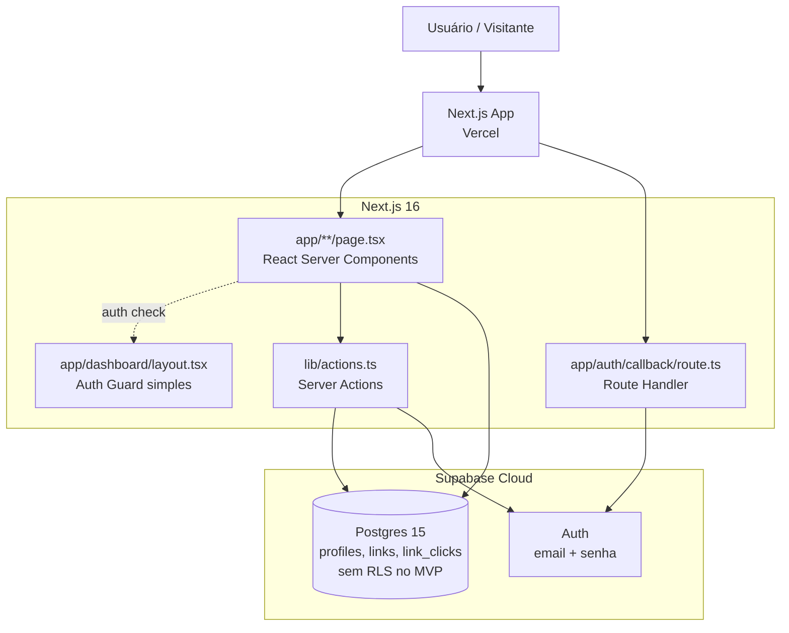
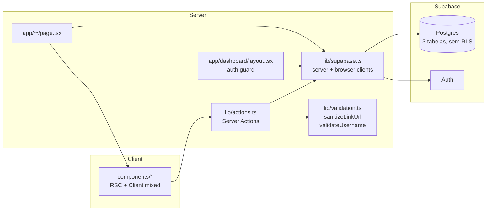
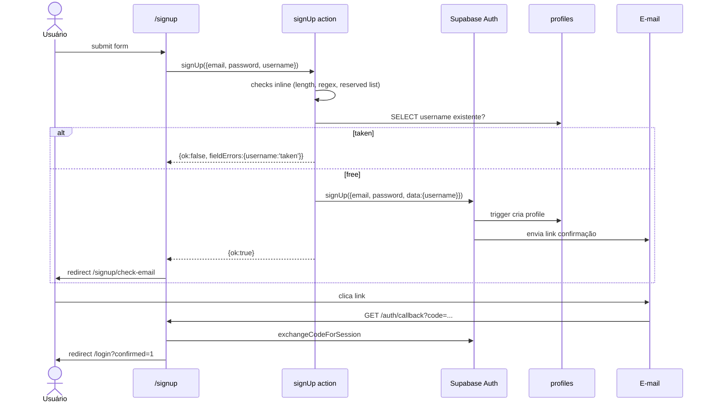
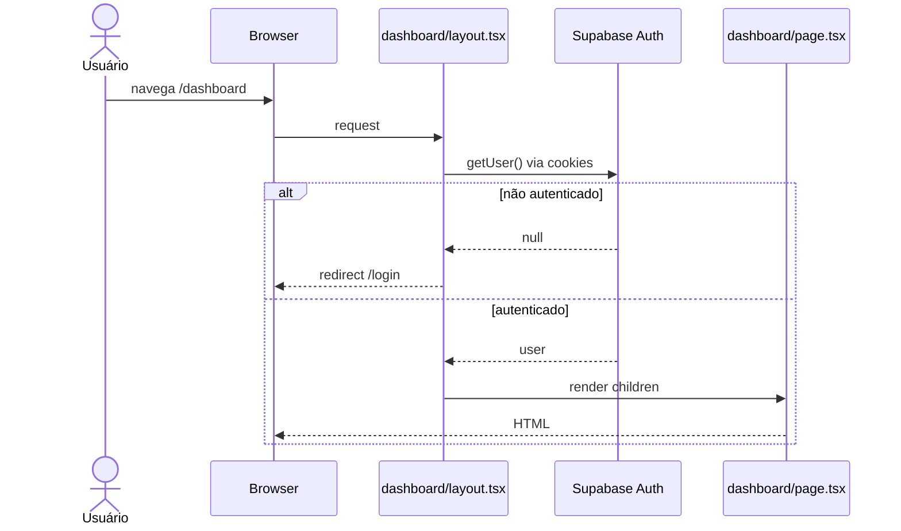
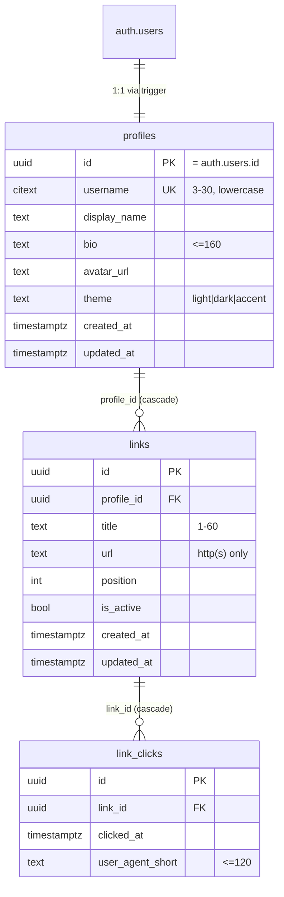

# youtube-biolink Fullstack Architecture Document

> **Status:** Approved v1.0
> **Autor:** Aria (Architect)
> **Data:** 2026-05-09
> **Insumo:** `docs/prd.md` v1.1 + `docs/brief.md` v1.0 + `docs/frontend-spec.md` v1.0 (2026-05-09)
> **Modo de geração:** YOLO, output monolítico

---

## 1. Introduction

Arquitetura fullstack **didática** do **youtube-biolink**: Next.js 16 (App Router + RSC + Server Actions) + Supabase (Postgres + Auth) + TypeScript strict.

O documento assume um **princípio orientador explícito**: *simplificar camadas, não paradigmas*. Mantemos o stack moderno (App Router, RSC, Server Actions, BaaS) porque é parte do que se quer ensinar; removemos preocupações de produção (RLS, rate limiting, middleware edge, logging estruturado, camadas UI/features, biblioteca de validação) que seriam reintroduzidas como **unidades didáticas próprias** em epics posteriores. Essa escolha cria dívida consciente contra alguns NFRs do PRD v1.0 — ver § 20 (Deferred Concerns & PRD Reconciliation).

### 1.1 Starter Template

**N/A — Greenfield project.** Iniciado via `create-next-app@latest` na Story 1.1.

### 1.2 Change Log

| Date       | Version | Description                                                                                                          | Author            |
|------------|---------|----------------------------------------------------------------------------------------------------------------------|-------------------|
| 2026-04-16 | 0.1     | Draft inicial: resolve H1–H4, stack + padrões completos incluindo RLS, middleware edge, rate-limit Supabase, logging wrapper. | Aria (Architect) |
| 2026-04-16 | 0.2     | **Simplificação didática** a pedido do owner: remove RLS, middleware edge, rate-limit, logging estruturado, split ui/features, zod. Paradigma moderno preservado. | Aria (Architect) |
| 2026-04-16 | 0.3     | DDL concreta incorporada ao doc (§ 9). Delegação ao @data-engineer dispensada — escopo reduzido pós-simplificação cabe no próprio documento. | Aria (Architect) |
| 2026-05-09 | 1.0     | Promovida a Approved após aprovação da Frontend Spec v1.0. Sem mudanças materiais — frontend-spec confirmou alinhamento com decisões arquiteturais (stack, rotas `/@username`, @dnd-kit, tokens CSS variables). | Aria (Architect) |

---

## 2. High Level Architecture

### 2.1 Technical Summary

**Jamstack minimalista** com Next.js 16 (App Router + RSC + Server Actions) na Vercel e Supabase como BaaS (Postgres + Auth). Toda a autenticação e autorização vivem na **camada de aplicação**: Server Actions carregam `user` via cookies e aplicam o filtro `profile_id = user.id` em leituras/mutações. A comunicação client↔server é feita exclusivamente por **Server Actions + RSC** — não há REST/GraphQL, não há middleware de edge, não há RLS no banco. Código roda em um único `components/` flat e valida inputs inline com checks TS diretos.

### 2.2 Platform and Infrastructure Choice

**Platform:** Vercel + Supabase Cloud
**Key Services:**
- **Vercel:** Next.js Hosting, Preview Deploys, Env Vars por scope
- **Supabase Cloud (projeto `production`):** Postgres 15 + Auth (e-mail/senha) + Email templates
- **Supabase Cloud (projeto `development`):** mesmo setup, usado por dev local + integration tests
- **GitHub Actions:** CI (typecheck + lint + test + build)

**Deployment Host and Regions:** Vercel `iad1` (default); Supabase `sa-east-1` ou `us-east-1`.

### 2.3 Repository Structure

**Structure:** Monorepo simples (single-package, sem workspaces).
**Monorepo Tool:** N/A.
**Package Organization:** raiz é a aplicação Next.js; `supabase/`, `docs/`, `tests/` como auxiliares.

### 2.4 High Level Architecture Diagram



### 2.5 Architectural Patterns

- **Jamstack + Serverless:** Next.js RSC + Server Actions na Vercel. — _Rationale:_ escala automaticamente no free tier, alinhado ao didatismo "fullstack moderno".
- **BaaS:** Supabase concentra Postgres + Auth. — _Rationale:_ elimina boilerplate de REST/GraphQL, ensina o padrão dominante.
- **Server-First Rendering:** RSC + Server Actions por default; Client Components só para interatividade. — _Rationale:_ secrets no server, menos JS no client, padrão idiomático Next.js 16.
- **Application-Layer Authorization:** Server Actions chamam `supabase.auth.getUser()` e filtram queries por `user.id`. Sem RLS no MVP. — _Rationale:_ a autorização fica visível no código TS, fácil de ler e discutir em um tutorial. RLS é apresentado depois como camada de defesa em profundidade.
- **Auth Guard via Layout:** `app/dashboard/layout.tsx` verifica user e chama `redirect('/login')` se ausente. — _Rationale:_ substitui middleware edge com um mecanismo Next.js idiomático e visível no diretório.
- **Reserved-list Routing:** `app/[username]/page.tsx` cobre a página pública; rotas estáticas (`/login`, `/dashboard`, `/signup`) vencem por precedência do App Router, e a lista de reservados (Story 2.3) bloqueia registros conflitantes. — _Rationale:_ não precisamos de middleware rewrite — o framework resolve.
- **Inline Validation:** checks TS diretos (`typeof`, `.length`, `.startsWith`) + helpers puros onde a lógica é reutilizável (`sanitizeLinkUrl`, `validateUsername`). — _Rationale:_ zero dependência extra; validação legível para quem está aprendendo o básico.
- **Flat Components:** tudo em `components/` sem split `ui/` vs `features/`. — _Rationale:_ volume do MVP (~15 componentes) não justifica ceremony de organização.

---

## 3. Tech Stack

### 3.1 Technology Stack Table

| Category              | Technology                      | Version           | Purpose                                          | Rationale                                                                                   |
|-----------------------|---------------------------------|-------------------|--------------------------------------------------|---------------------------------------------------------------------------------------------|
| Frontend Language     | TypeScript                      | 5.6+ strict       | Tipagem estática end-to-end                      | PRD NFR5                                                                                    |
| Frontend Framework    | Next.js                         | 16.x              | App Router + RSC + Server Actions                | PRD stack travada                                                                           |
| UI Primitives         | shadcn/ui (copied)              | latest snapshot   | Button, Input, Card, Avatar, Chart               | Copy-paste, não dependência                                                                 |
| CSS Framework         | Tailwind CSS                    | 4.x               | Styling + tokens via CSS variables               | PRD stack travada; integra com shadcn                                                       |
| Drag-and-Drop         | `@dnd-kit/core` + `sortable`    | 6.x               | Reordenação acessível de links                   | PRD explicita dnd-kit                                                                       |
| Forms                 | `react-hook-form`                | 7.x               | Forms controlados                                | Opcional; pode-se usar `useState` puro se didaticamente preferido em stories iniciais       |
| Validation            | **Inline TS + helpers puros**   | —                 | Checks diretos nos Server Actions                | Zero dependência; didática mais direta                                                      |
| Charts                | Recharts (via shadcn `Chart`)   | 2.x               | Gráfico de cliques (Epic 5)                      | Code-split em `/dashboard/analytics`                                                        |
| State Management      | RSC + `useState`/`useOptimistic` | React 19         | Estado local; sem stores globais                 | Zero overhead; React built-ins cobrem MVP                                                   |
| Backend Language      | TypeScript                      | 5.6+              | Server Actions + Route Handlers                  | Mesma linguagem end-to-end                                                                  |
| Backend Framework     | Next.js Server Actions          | 16.x              | Mutações tipadas sem REST                        | Elimina boilerplate                                                                         |
| API Style             | Server Actions + RSC            | —                 | Comunicação tipada client↔server                 | Route Handlers apenas para `/auth/callback` e `/health`                                     |
| Database              | Postgres (Supabase)             | 15.x              | OLTP + agregação                                 | PRD stack travada                                                                           |
| Database Access       | `@supabase/ssr`                 | 0.5+              | Server client (cookies) + browser client         | Padrão oficial Supabase Next.js                                                             |
| Authorization         | **App-layer (user.id filter)**  | —                 | Server Actions filtram por `user.id`             | RLS deferido para epic didático pós-MVP                                                     |
| Cache                 | Next.js `revalidatePath`        | nativo            | Invalidação após mutação                         | ISR agressivo (`revalidate=60`) fica opcional; stories podem ligar em Epic 3                |
| File Storage          | N/A no MVP                      | —                 | Avatar é URL externa                             | Phase 2                                                                                     |
| Authentication        | Supabase Auth (e-mail+senha)    | incluso           | Signup/login/reset com verificação               | PRD MVP                                                                                     |
| Rate Limiting         | **Deferido (§ 20)**             | —                 | —                                                | Merece seu próprio capítulo didático                                                        |
| Logging               | `console.error` / `console.log` | nativo            | Observabilidade mínima                           | Sem wrapper; logs textuais. Estruturado e Sentry em Phase 2                                 |
| Frontend Testing      | Vitest + RTL                    | 2.x               | Componentes + hooks                              | PRD stack travada                                                                           |
| Backend Testing       | Vitest (node)                   | 2.x               | Helpers puros + Server Actions                   | PRD meta ≥70% em `lib/`                                                                     |
| Integration Testing   | Vitest contra Supabase `development` | 2.x          | Server Actions end-to-end com DB real            | Unique-user por teste (§ 14.3) + CI serialization                                           |
| E2E Testing           | **Nenhum automatizado**         | —                 | Smoke test manual (Story 5.6)                    | PRD decisão explícita                                                                       |
| Package Manager       | pnpm                            | 9.x               | Install + lockfile                               | PRD stack travada                                                                           |
| Runtime               | Node.js                         | 20.x LTS          | CI + Vercel Functions                            | Next.js 16 requer ≥20                                                                       |
| CI/CD                 | GitHub Actions                  | —                 | typecheck + lint + test + build                  | PRD stack travada                                                                           |
| Migrations            | Supabase CLI (`db push`)        | 1.200+            | SQL versionado em `supabase/migrations/`         | PRD explicita; sem instância local                                                          |
| Commit Conventions    | commitlint + husky              | commitlint 19.x   | Conventional commits                             | PRD NFR9                                                                                    |
| Linting               | ESLint + `next/core-web-vitals` | eslint 9.x        | Enforce code style                               | PRD stack travada                                                                           |
| Formatting            | Prettier                        | 3.x               | Format automatizado                              | PRD stack travada                                                                           |

---

## 4. Data Models

Modelos conceituais compartilhados client↔server. Schemas SQL detalhados delegados ao **@data-engineer** (Stories 2.1, 3.1, 5.1) — **sem RLS no MVP**.

### 4.1 Profile

```typescript
// lib/types.ts
export type Theme = 'light' | 'dark' | 'accent';

export interface Profile {
  id: string;                     // = auth.users.id (UUID)
  username: string;               // citext unique, 3-30 chars
  display_name: string | null;
  bio: string | null;             // ≤160 chars
  avatar_url: string | null;
  theme: Theme;
  created_at: string;
  updated_at: string | null;
}
```

### 4.2 Link

```typescript
export interface Link {
  id: string;
  profile_id: string;             // FK profiles.id
  title: string;                  // 1-60 chars
  url: string;                    // http(s) apenas
  position: number;
  is_active: boolean;
  created_at: string;
  updated_at: string | null;
}
```

### 4.3 LinkClick

```typescript
export interface LinkClick {
  id: string;
  link_id: string;                // FK links.id
  clicked_at: string;
  user_agent_short: string | null; // ≤120 chars
}
```

### 4.4 View — `link_click_daily`

Agregação `(link_id, dia) → count` para o dashboard de analytics. Decisão materializada vs regular: @data-engineer na Story 5.4.

---

## 5. API Specification

Comunicação client↔server via **Server Actions** (funções `async` com `'use server'`) e **RSC** (fetching direto). **Sem REST/GraphQL**.

**Route Handlers** existem apenas para:
1. `GET /auth/callback` — callback do Supabase Auth.
2. `GET /health` — canary (Story 1.7).

### 5.1 Convenção de Server Action (simplificada)

```typescript
// lib/actions/types.ts
export type ActionResult<T = void> =
  | { ok: true; data?: T }
  | { ok: false; error: string; fieldErrors?: Record<string, string> };
```

Toda Server Action:
1. Importa `'use server'`.
2. Recebe `FormData` ou objeto tipado.
3. Parse input com checks TS inline (ver exemplos § 9.1).
4. Chama `supabase.auth.getUser()` quando requer auth; retorna `{ ok: false, error: 'Not signed in' }` se ausente.
5. Executa query via `createServerClient()` filtrando por `user.id` onde aplicável.
6. Retorna `ActionResult<T>`; nunca lança.
7. Chama `revalidatePath()` após mutação relevante.

### 5.2 Server Actions Catálogo

| Action                 | Epic/Story | Input                                  | Revalidação                            |
|------------------------|-----------|----------------------------------------|----------------------------------------|
| `signUp`               | 2.4       | `{ email, password, username }`        | —                                      |
| `signIn`               | 2.6       | `{ email, password }`                  | `revalidatePath('/', 'layout')`        |
| `signOut`              | 2.8       | —                                       | `revalidatePath('/', 'layout')`        |
| `requestPasswordReset` | 2.7       | `{ email }`                             | —                                      |
| `confirmPasswordReset` | 2.7       | `{ password }`                          | —                                      |
| `updateProfile`        | 2.10      | `{ display_name, bio, avatar_url }`     | `revalidatePath('/[username]', 'page')` |
| `updateTheme`          | 4.3       | `{ theme }`                             | idem                                   |
| `createLink`           | 3.3       | `{ title, url }`                        | `revalidatePath('/dashboard/links')` + `/[username]` |
| `updateLink`           | 3.3       | `{ id, title?, url? }`                  | idem                                   |
| `deleteLink`           | 3.3       | `{ id }`                                | idem                                   |
| `toggleLinkActive`     | 3.3       | `{ id, is_active }`                     | idem                                   |
| `reorderLinks`         | 3.4       | `{ ids: string[] }`                     | idem                                   |
| `trackLinkClick`       | 5.2       | `{ linkId }`                            | —                                      |

---

## 6. Components

### 6.1 Component Diagram (simplificado)



### 6.2 Descrição Resumida

- **`components/*`** — tudo num diretório só (primitivos shadcn copiados + componentes de domínio). Exemplos: `button.tsx`, `link-form.tsx`, `link-list.tsx`, `profile-form.tsx`, `theme-selector.tsx`, `public-link-item.tsx`, `analytics-chart.tsx`.
- **`app/**/page.tsx`** — páginas em RSC; fetching direto no render para dados próprios do user ou da página pública.
- **`app/dashboard/layout.tsx`** — auth guard idiomático: chama `getUser()`, `redirect('/login')` se ausente.
- **`lib/actions.ts`** (ou dividido por domínio em `lib/actions/`) — todas as Server Actions.
- **`lib/supabase.ts`** — `createServerClient()` (cookies) + `createBrowserClient()` (raro). Sem `admin.ts` no MVP (sem operações que exigem bypass).
- **`lib/validation.ts`** — helpers puros: `sanitizeLinkUrl`, `validateUsername`.

---

## 7. External APIs

**N/A no MVP.** Todas as integrações são internas (Supabase).

---

## 8. Core Workflows

### 8.1 Signup + E-mail Confirmation



### 8.2 Dashboard Access (auth via layout)



### 8.3 Página Pública + Tracking

```mermaid
sequenceDiagram
    actor V as Visitante
    participant FE as /[username]
    participant DB as profiles + links
    participant TA as trackLinkClick

    V->>FE: GET /alessandro
    FE->>DB: SELECT profile + active links (sem auth)
    DB-->>FE: data
    FE-->>V: HTML
    V->>V: clica link
    V->>TA: trackLinkClick(linkId) [fire-and-forget]
    V->>V: navega target
    TA->>DB: INSERT link_clicks
    Note over TA,DB: tabela aberta no MVP;<br/>service-role não requerido sem RLS
```

---

## 9. Database Schema (concreto)

DDL completa por migration, mapeada às stories. Cada bloco abaixo é o conteúdo literal do arquivo `supabase/migrations/{timestamp}_{nome}.sql` correspondente. `{timestamp}` segue formato `YYYYMMDDHHMMSS` gerado por `supabase migration new`.

### 9.1 Baseline (Story 1.4) — `{ts}_baseline.sql`

```sql
-- Extensões
CREATE EXTENSION IF NOT EXISTS "pgcrypto";   -- gen_random_uuid()
CREATE EXTENSION IF NOT EXISTS "citext";     -- username case-insensitive

-- Função utilitária reutilizada pelos triggers updated_at
CREATE OR REPLACE FUNCTION public.set_updated_at()
RETURNS trigger
LANGUAGE plpgsql
AS $$
BEGIN
  NEW.updated_at = now();
  RETURN NEW;
END;
$$;
```

### 9.2 Profiles (Story 2.1) — `{ts}_profiles.sql`

```sql
CREATE TABLE public.profiles (
  id uuid PRIMARY KEY REFERENCES auth.users(id) ON DELETE CASCADE,
  username citext UNIQUE NOT NULL,
  display_name text,
  bio text CHECK (bio IS NULL OR char_length(bio) <= 160),
  avatar_url text,
  theme text NOT NULL DEFAULT 'light' CHECK (theme IN ('light', 'dark', 'accent')),
  created_at timestamptz NOT NULL DEFAULT now(),
  updated_at timestamptz,
  CONSTRAINT username_format CHECK (
    char_length(username) BETWEEN 3 AND 30
    AND username ~ '^[a-z][a-z0-9_]*$'
  )
);

-- Trigger updated_at
CREATE TRIGGER profiles_set_updated_at
  BEFORE UPDATE ON public.profiles
  FOR EACH ROW
  EXECUTE FUNCTION public.set_updated_at();

-- Trigger de sincronização auth.users → profiles
-- SECURITY DEFINER para executar com privilégio elevado sem RLS no caminho
CREATE OR REPLACE FUNCTION public.handle_new_user()
RETURNS trigger
LANGUAGE plpgsql
SECURITY DEFINER
SET search_path = public
AS $$
BEGIN
  INSERT INTO public.profiles (id, username)
  VALUES (
    NEW.id,
    NEW.raw_user_meta_data->>'username'
  );
  RETURN NEW;
END;
$$;

CREATE TRIGGER on_auth_user_created
  AFTER INSERT ON auth.users
  FOR EACH ROW
  EXECUTE FUNCTION public.handle_new_user();
```

> **Nota sobre `citext` + UNIQUE:** o tipo já garante comparação case-insensitive, então `UNIQUE (username)` cobre o caso de `Alessandro` vs `alessandro` sem índice adicional em `lower(username)`. A aplicação normaliza para lowercase antes de `signUp` (Story 2.3); a CHECK constraint reforça a invariante no banco.

### 9.3 Links (Story 3.1) — `{ts}_links.sql`

```sql
CREATE TABLE public.links (
  id uuid PRIMARY KEY DEFAULT gen_random_uuid(),
  profile_id uuid NOT NULL REFERENCES public.profiles(id) ON DELETE CASCADE,
  title text NOT NULL CHECK (char_length(title) BETWEEN 1 AND 60),
  url text NOT NULL CHECK (url ~ '^https?://'),
  position int NOT NULL DEFAULT 0,
  is_active boolean NOT NULL DEFAULT true,
  created_at timestamptz NOT NULL DEFAULT now(),
  updated_at timestamptz
);

CREATE INDEX idx_links_profile_position
  ON public.links (profile_id, position);

CREATE TRIGGER links_set_updated_at
  BEFORE UPDATE ON public.links
  FOR EACH ROW
  EXECUTE FUNCTION public.set_updated_at();
```

> **Nota sobre sanitização de URL:** a CHECK constraint é última linha de defesa, mas a sanitização primária acontece em `lib/validation.ts` / `sanitizeLinkUrl` (Story 3.2). O CHECK aqui só valida scheme; rejeição de `javascript:`, `data:` etc. é feita no TS porque é mais legível ensinar lá.

### 9.4 Link Clicks (Story 5.1) — `{ts}_link_clicks.sql`

```sql
CREATE TABLE public.link_clicks (
  id uuid PRIMARY KEY DEFAULT gen_random_uuid(),
  link_id uuid NOT NULL REFERENCES public.links(id) ON DELETE CASCADE,
  clicked_at timestamptz NOT NULL DEFAULT now(),
  user_agent_short text CHECK (
    user_agent_short IS NULL OR char_length(user_agent_short) <= 120
  )
);

CREATE INDEX idx_link_clicks_link_clicked
  ON public.link_clicks (link_id, clicked_at DESC);
```

### 9.5 View de agregação (Story 5.4) — `{ts}_link_click_daily.sql`

```sql
CREATE OR REPLACE VIEW public.link_click_daily AS
SELECT
  link_id,
  date_trunc('day', clicked_at) AS day,
  count(*)::bigint AS clicks
FROM public.link_clicks
GROUP BY link_id, date_trunc('day', clicked_at);

-- Nota didática: começamos com view regular (não materializada).
-- Se benchmark da Story 5.4 mostrar query >100ms em 10k rows, migrar para
-- CREATE MATERIALIZED VIEW + cron de refresh. Medir antes de otimizar.
```

### 9.6 ER Diagram



### 9.7 Diretrizes Gerais

- **UUIDs** via `gen_random_uuid()` (pgcrypto).
- **Timestamps** sempre `timestamptz` default `now()` (UTC).
- **Autorização** na aplicação — todo Server Action filtra por `user.id`.
- **Cascade deletes** em FKs (`ON DELETE CASCADE`) simplificam cleanup em integration tests (deletar user → remove tudo).
- **Migrations destrutivas** (DROP TABLE, DROP COLUMN, mudança de tipo incompatível) exigem PR com label `db:destructive` (NFR20 mantido).
- **Reversibilidade:** migrations idempotentes quando possível (`CREATE ... IF NOT EXISTS`, `CREATE OR REPLACE`). Down migrations explícitas não são geradas pela CLI do Supabase — documentar rollback manual em comentário do PR se necessário.
- **Drift detection** (CI): proposta para Epic 1 — rodar `supabase db diff --linked` contra `development` em CI e falhar se houver divergência não commitada.

### 9.1 Exemplo de Server Action (validação inline + authz aplicação)

```typescript
// lib/actions/links.ts
'use server';
import { revalidatePath } from 'next/cache';
import { createServerClient } from '@/lib/supabase';
import { sanitizeLinkUrl } from '@/lib/validation';
import type { ActionResult } from './types';
import type { Link } from '@/lib/types';

const MAX_LINKS = 30;
const MAX_TITLE = 60;

export async function createLink(input: { title: unknown; url: unknown }): Promise<ActionResult<Link>> {
  const supabase = await createServerClient();
  const { data: { user } } = await supabase.auth.getUser();
  if (!user) return { ok: false, error: 'Faça login para continuar' };

  // Validação inline
  const title = typeof input.title === 'string' ? input.title.trim() : '';
  const urlRaw = typeof input.url === 'string' ? input.url.trim() : '';
  const fieldErrors: Record<string, string> = {};
  if (!title) fieldErrors.title = 'Título é obrigatório';
  else if (title.length > MAX_TITLE) fieldErrors.title = `Máximo ${MAX_TITLE} caracteres`;

  const sanitized = sanitizeLinkUrl(urlRaw);
  if (!sanitized.ok) fieldErrors.url = sanitized.error;

  if (Object.keys(fieldErrors).length > 0) {
    return { ok: false, error: 'Corrija os campos', fieldErrors };
  }

  // Limite de 30 links
  const { count } = await supabase
    .from('links')
    .select('*', { count: 'exact', head: true })
    .eq('profile_id', user.id);

  if ((count ?? 0) >= MAX_LINKS) {
    return { ok: false, error: `Máximo ${MAX_LINKS} links por perfil` };
  }

  const { data, error } = await supabase
    .from('links')
    .insert({
      profile_id: user.id,                     // authz: só cria para si
      title,
      url: sanitized.value,
      position: count ?? 0,
    })
    .select()
    .single();

  if (error) {
    console.error('createLink failed', error);
    return { ok: false, error: 'Não foi possível criar o link' };
  }

  revalidatePath('/dashboard/links');
  return { ok: true, data: data as Link };
}
```

---

## 10. Frontend Architecture

### 10.1 Component Organization

```
components/
├── button.tsx                 # shadcn primitivo
├── input.tsx
├── textarea.tsx
├── card.tsx
├── avatar.tsx
├── label.tsx
├── toast.tsx
├── dialog.tsx
├── chart.tsx                  # wrapper Recharts
├── profile-form.tsx
├── theme-selector.tsx
├── link-list.tsx              # drag-and-drop
├── link-item.tsx
├── link-form.tsx
├── public-link-item.tsx       # client, onClick tracking
└── analytics-chart.tsx
```

Convenção: PascalCase no export, kebab-case no arquivo. RSC por default; `'use client'` só quando necessário.

### 10.2 State Management

- **Server state:** RSC + `revalidatePath` após mutação.
- **Form state:** `react-hook-form` (opcional; `useState` puro serve para forms simples).
- **Optimistic UI:** `useOptimistic` de React 19 em `toggleLinkActive` e `reorderLinks`.
- **Nada global:** sem Zustand/Redux/Jotai. Se um dia precisar, introduzir no epic correspondente.

### 10.3 Routing

```
app/
├── layout.tsx                      # RootLayout: HTML, Toaster
├── page.tsx                        # / landing (redirect para /login se unauthed)
├── [username]/
│   ├── page.tsx                    # página pública (RSC)
│   └── not-found.tsx               # 404
├── signup/
│   ├── page.tsx
│   └── check-email/page.tsx
├── login/page.tsx
├── reset-password/
│   ├── page.tsx                    # request
│   └── confirm/page.tsx
├── auth/
│   ├── callback/route.ts
│   └── confirm-failed/page.tsx
├── dashboard/
│   ├── layout.tsx                  # auth guard
│   ├── page.tsx                    # perfil + tema
│   ├── links/page.tsx
│   └── analytics/page.tsx
└── health/route.ts
```

**Sem middleware.ts na raiz.** Página pública usa `[username]` direto — a reserved-list (Story 2.3) impede conflito com rotas estáticas.

### 10.3.1 Auth Guard via Layout

```typescript
// app/dashboard/layout.tsx
import { redirect } from 'next/navigation';
import { createServerClient } from '@/lib/supabase';

export default async function DashboardLayout({ children }: { children: React.ReactNode }) {
  const supabase = await createServerClient();
  const { data: { user } } = await supabase.auth.getUser();
  if (!user) redirect('/login');
  return <>{children}</>;
}
```

### 10.3.2 Página Pública Resolution

```typescript
// app/[username]/page.tsx
import { notFound } from 'next/navigation';
import { createServerClient } from '@/lib/supabase';

export const revalidate = 60; // ISR opcional — pode começar sem e adicionar em Epic 3

export default async function PublicProfilePage({ params }: { params: Promise<{ username: string }> }) {
  const { username } = await params;
  const supabase = await createServerClient();

  const { data: profile } = await supabase
    .from('profiles')
    .select('username, display_name, bio, avatar_url, theme')
    .ilike('username', username)
    .maybeSingle();

  if (!profile) notFound();

  const { data: links } = await supabase
    .from('links')
    .select('id, title, url, position')
    .eq('profile_id', (await supabase.from('profiles').select('id').ilike('username', username).single()).data!.id)
    .eq('is_active', true)
    .order('position', { ascending: true });

  return <PublicProfile profile={profile} links={links ?? []} />;
}
```

> Nota didática: o double-query acima é intencional para manter o exemplo legível. Story 3.5 pode refatorar para um único `select` com relações Supabase (`.select('*, links(*)')`).

---

## 11. Backend Architecture

### 11.1 Structure

```
lib/
├── supabase.ts        # createServerClient() + createBrowserClient()
├── actions/           # OU lib/actions.ts single file
│   ├── auth.ts        # signUp, signIn, signOut, reset
│   ├── profile.ts     # updateProfile, updateTheme
│   ├── links.ts       # createLink, updateLink, deleteLink, toggle, reorder
│   └── analytics.ts   # trackLinkClick
├── validation.ts      # sanitizeLinkUrl, validateUsername, RESERVED_USERNAMES
└── types.ts           # Profile, Link, LinkClick, Theme, ActionResult
```

### 11.2 Supabase Clients (sem admin no MVP)

```typescript
// lib/supabase.ts
import { cookies } from 'next/headers';
import { createServerClient as createSSRClient, createBrowserClient as createCSRClient } from '@supabase/ssr';

export async function createServerClient() {
  const cookieStore = await cookies();
  return createSSRClient(
    process.env.NEXT_PUBLIC_SUPABASE_URL!,
    process.env.NEXT_PUBLIC_SUPABASE_ANON_KEY!,
    {
      cookies: {
        getAll: () => cookieStore.getAll(),
        setAll: (cookies) => {
          try {
            cookies.forEach(({ name, value, options }) => cookieStore.set(name, value, options));
          } catch { /* Server Component sem permissão de set — ok se middleware/layout refrescaram */ }
        },
      },
    }
  );
}

export function createBrowserClient() {
  return createCSRClient(
    process.env.NEXT_PUBLIC_SUPABASE_URL!,
    process.env.NEXT_PUBLIC_SUPABASE_ANON_KEY!,
  );
}
```

### 11.3 Authentication & Authorization

- **Autenticação:** Supabase Auth via `@supabase/ssr`; cookies `HttpOnly; Secure; SameSite=Lax` geridos automaticamente.
- **Guard de rotas:** `app/dashboard/layout.tsx` (§ 10.3.1).
- **Authorization:** na camada de aplicação — toda Server Action que muta filtra por `profile_id = user.id`. Toda Server Action que lê dados próprios também filtra. Leituras públicas (página `/[username]`) consultam sem auth.
- **Risco consciente:** sem RLS, uma Server Action que esquece o filtro `user.id` vaza/corrompe dados. Aceitável em MVP didático; RLS é o conteúdo do epic de hardening pós-MVP.

---

## 12. Unified Project Structure

```plaintext
youtube-biolink/
├── .github/
│   └── workflows/
│       └── ci.yml
├── app/                            # Next.js App Router (ver § 10.3)
├── components/                     # flat: primitivos + domínio
├── lib/
│   ├── supabase.ts
│   ├── actions/ (ou actions.ts)
│   ├── validation.ts
│   └── types.ts
├── supabase/
│   ├── config.toml
│   └── migrations/                 # SQL sem RLS no MVP
├── tests/
│   ├── unit/
│   └── integration/
├── docs/
│   ├── brief.md
│   ├── prd.md
│   ├── architecture.md             # este documento
│   ├── smoke-test.md
│   ├── design-system.md
│   └── stories/
├── scripts/
│   └── seed-dev.ts
├── public/
├── .env.example
├── .env.local                      # gitignored
├── .prettierrc / eslint.config.js / commitlint.config.js / .husky/
├── next.config.ts / tailwind.config.ts / tsconfig.json / vitest.config.ts
├── package.json / pnpm-lock.yaml
├── LICENSE (MIT)
└── README.md                       # pt-BR, setup <15min
```

---

## 13. Deployment

### 13.1 Strategy

- **Frontend + Backend:** Vercel (Next.js build).
- **Database:** Supabase Cloud em dois projetos (`production`, `development`).
- **Migrations:** `supabase db push` aplicado manualmente no `development` pelos devs; CI aplica em `production` após merge na `main` (exceto migrations com label `db:destructive` que exigem aprovação manual).
- **Environments:** Production → Supabase `production`. Preview + Dev → Supabase `development`.

### 13.2 CI Pipeline (esboço — Story 1.5 finaliza)

```yaml
name: CI
on:
  pull_request:
  push: { branches: [main] }

concurrency:
  group: integration-tests-development
  cancel-in-progress: false

jobs:
  quality:
    runs-on: ubuntu-latest
    steps:
      - uses: actions/checkout@v4
      - uses: pnpm/action-setup@v4
        with: { version: 9 }
      - uses: actions/setup-node@v4
        with: { node-version: 20, cache: pnpm }
      - run: pnpm install --frozen-lockfile
      - run: pnpm typecheck
      - run: pnpm lint
      - run: pnpm test:unit
      - run: pnpm test:integration
        env:
          NEXT_PUBLIC_SUPABASE_URL: ${{ secrets.SUPABASE_URL_DEV }}
          NEXT_PUBLIC_SUPABASE_ANON_KEY: ${{ secrets.SUPABASE_ANON_KEY_DEV }}
      - run: pnpm build
```

> Nota: `SUPABASE_SERVICE_ROLE_KEY` permanece como secret disponível em CI para o helper de cleanup de integration tests (§ 14.3), mesmo que não seja usado em Server Actions de produção no MVP.

---

## 14. Security & Performance

### 14.1 Security (MVP — simplificado)

- **HTTPS + HSTS:** Vercel automático.
- **Secrets:** apenas env vars; `.env.local` gitignored.
- **Password:** ≥8 chars (Supabase default + check inline client).
- **Cookie Session:** `HttpOnly; Secure; SameSite=Lax` via `@supabase/ssr`.
- **XSS:** React escape default; zero `dangerouslySetInnerHTML`.
- **URL sanitization:** `sanitizeLinkUrl` rejeita `javascript:`, `data:`, `vbscript:`, `file:`.
- **PII mínimo em `link_clicks`:** sem IP raw, UA truncado 120 chars (NFR19 mantido).
- **Authorization:** app-layer (Server Actions com `user.id` filter).

**Deferidos (§ 20):** RLS, rate limiting, CSP formal, estrutura de logs.

### 14.2 Performance (MVP)

- **LCP target:** <2.5s em 4G (NFR1) — validado manualmente com Lighthouse.
- **Bundle:** <150KB gzipped inicial (NFR1). Recharts code-split em `/dashboard/analytics`.
- **ISR:** `revalidate=60` em `/[username]` (opcional; Story 3.5 pode introduzir).
- **Índices:** delegados ao @data-engineer.

---

## 15. Testing Strategy

### 15.1 Testing Pyramid

```text
          Smoke Manual (Story 5.6)
                   |
           Integration Tests
                   |
              Unit Tests
```

### 15.2 Structure

```
tests/
├── unit/
│   ├── validation/
│   │   ├── url.test.ts            # sanitizeLinkUrl (≥15 asserts)
│   │   └── username.test.ts
│   ├── actions/                   # Supabase mockado
│   │   ├── links.test.ts
│   │   └── profile.test.ts
│   └── components/                # RTL
│       └── profile-form.test.tsx
└── integration/                   # contra Supabase `development`
    ├── signup.test.ts
    ├── create-link.test.ts
    ├── public-page.test.ts
    └── helpers/
        ├── unique-user.ts
        └── cleanup.ts
```

### 15.3 Integration Isolation (H4 mantida)

Cada teste cria seu próprio user (email `test-{run_id}-{uuid}@youtube-biolink.test`), opera só com suas credenciais, e deleta o user no teardown via `admin.auth.admin.deleteUser()` (cascade remove profile/links/clicks).

- CI `concurrency.group: integration-tests-development` serializa runs.
- Auto-confirm de email via admin create (`email_confirm: true`).
- Cleanup mensal via script cron para users órfãos.

Sem RLS, não existem mais os testes de RLS cross-user (`user A não altera dado de B`) — eles voltam quando RLS for introduzido no epic de hardening.

---

## 16. Coding Standards

- **Server Actions:** arquivos com `'use server'` no topo; retornam `ActionResult<T>`; nunca lançam.
- **Env Access:** `process.env.*` só em `lib/supabase.ts`, `lib/actions/*`, `layouts` e Route Handlers. Nunca em Client Components.
- **Authorization:** toda Server Action que muta/lê dados do user filtra por `user.id`. Se esquecer, o bug é grave — mas é o bug que RLS virá consertar no epic de hardening.
- **URL Sanitization:** toda URL externa passa por `sanitizeLinkUrl`.
- **Absolute Imports:** `@/*` alias; relativos proibidos exceto dentro do mesmo módulo imediato.
- **Conventional Commits:** `feat(scope): descrição [Story X.Y]`.
- **Naming:**
  - Components PascalCase export, kebab-case arquivo (`profile-form.tsx` exporta `ProfileForm`).
  - Server Actions camelCase verbo-primeiro (`createLink`, `trackLinkClick`).
  - DB tables snake_case plural (`profiles`, `links`, `link_clicks`).
  - Constantes SCREAMING_SNAKE_CASE.

---

## 17. Error Handling

```typescript
// Padrão simples — sem wrapper, sem requestId, sem Sentry
export async function updateProfile(input: { bio?: unknown }): Promise<ActionResult<void>> {
  const supabase = await createServerClient();
  const { data: { user } } = await supabase.auth.getUser();
  if (!user) return { ok: false, error: 'Faça login' };

  const bio = typeof input.bio === 'string' ? input.bio.trim() : null;
  if (bio !== null && bio.length > 160) {
    return { ok: false, error: 'Bio não pode ter mais de 160 caracteres', fieldErrors: { bio: 'máximo 160' } };
  }

  const { error } = await supabase
    .from('profiles')
    .update({ bio })
    .eq('id', user.id);

  if (error) {
    console.error('updateProfile failed', error);
    return { ok: false, error: 'Não foi possível atualizar o perfil' };
  }

  revalidatePath('/dashboard');
  return { ok: true };
}
```

**Boundaries visuais:**
- `app/error.tsx` — catch em RSC render.
- `app/not-found.tsx` — 404 global.
- `app/[username]/not-found.tsx` — 404 de username.

---

## 18. Monitoring (MVP-light)

- **Logs:** `console.log` / `console.error` textuais. Vercel captura e exibe no dashboard de Functions.
- **Web Vitals:** Vercel Analytics built-in (free tier).
- **Alertas:** nenhum no MVP. Checagem manual.

---

## 19. Delegações

### 19.1 @data-engineer — dispensada no MVP

Pós-simplificação (v0.2) + DDL concreta embutida (§ 9 em v0.3), não há escopo suficiente para justificar uma delegação formal ao @data-engineer. Os DDL totais são ~60 linhas de SQL triviais sem RLS, sem RPCs, sem otimização de query. O trabalho vai direto para @dev nas Stories 2.1, 3.1, 5.1 (escrever a migration correspondente ao bloco de § 9 e aplicar via `supabase db push`).

**@data-engineer será reativado** no Epic 6 (Hardening), quando RLS policies voltarem — aí sim há escopo de design de schema com análise de cenários de autorização.

### 19.2 @ux-design-expert (Uma)

**Inputs:** `docs/architecture.md` § 10.3 (estrutura de rotas) + `docs/prd.md` § 3 (UI Design Goals) + § 6 Stories.

**Deliverables entregues em `docs/frontend-spec.md` v1.0 (aprovada 2026-05-09):**
- [x] Wireframes low-fi mobile-first (360px) + desktop (1024px+) das 9 core screens — materializados em `docs/design/prototypes/` + `docs/frontend-spec.md` § 2.
- [x] Exemplos visuais dos 3 temas (`light`, `dark`, `accent`) aplicados à página pública e dashboard — tokens CSS variables em `docs/design/system/project/colors_and_type.css`.
- [x] Estados vazio/loading/erro das telas críticas — cobertos no protótipo.
- [x] Especificação visual do drag-and-drop (hover, grabbing, drop indicator) com alternativa keyboard — `docs/frontend-spec.md` § 7 (a11y completa: @dnd-kit/core + KeyboardSensor + announcements pt-BR).

---

## 20. Deferred Concerns & PRD Reconciliation

### 20.1 O que foi removido da arquitetura base e por quê

| Item removido                     | Motivo                                                               | Quando reintroduzir                                   |
|-----------------------------------|----------------------------------------------------------------------|------------------------------------------------------|
| **RLS em todas as tabelas**       | Alta carga conceitual para começar; autorização app-layer é mais legível em tutorial | Epic dedicado "Segurança em Camadas" após Epic 3 |
| **Middleware Edge (`middleware.ts`)** | Layout-based guard é mais idiomático Next.js 16 e visível no diretório | Quando a lição for "edge runtime + rewrites"     |
| **Rate limiting (tabela + RPC)**  | Não crítico em MVP didático; merece seu próprio capítulo             | Epic "Hardening & Abuse Prevention" pós-MVP         |
| **`withActionLogging` + JSON structured logs** | `console.error` basta; observabilidade estruturada merece capítulo com Sentry | Phase 2, junto com Sentry                          |
| **Split `components/ui` vs `components/features`** | Volume (~15 componentes) não justifica; flat é mais didático         | Quando passar de ~30 componentes                     |
| **Biblioteca `zod`**              | Checks TS inline mostram fundamentos de validação; biblioteca é incremento | Story/Epic dedicado à "validação declarativa"    |
| **Middleware rewrite `/@username` → `/u/[username]`** | `app/[username]` + reserved list resolve sem hack                   | Se brand URL `/@` virar prioridade                   |
| **`createAdminClient` (SERVICE_ROLE)** | Sem RLS, não precisamos bypass. Single anon client server-side       | Volta com o epic de RLS (click tracking insert)      |
| **Testes de RLS cross-user**      | Removidos com RLS                                                    | Voltam com o epic de RLS                             |

### 20.2 O que foi mantido (alinhado ao "simplificar camadas, não paradigmas")

- **App Router + RSC + Server Actions** (paradigma central do ensino)
- **Supabase como BaaS** (Auth + Postgres)
- **TypeScript strict**
- **Tailwind + shadcn/ui** (copy-paste, flat em `components/`)
- **Vercel + GitHub Actions** (deploy + CI)
- **Migrations via Supabase CLI** em 2 projetos cloud
- **Convenções do projeto:** conventional commits, absolute imports, conventional commits
- **Testes:** Vitest unit + integration contra `development` (unique-user isolation mantido)
- **Smoke test manual** (Story 5.6)

### 20.3 Conflito com o PRD v1.0 (a resolver pelo @pm)

A simplificação cria dívida consciente contra os seguintes itens do PRD:

| Item do PRD                          | Status após v0.2              | Ação recomendada                                                |
|--------------------------------------|-------------------------------|----------------------------------------------------------------|
| **NFR3** — RLS obrigatório em profiles/links/link_clicks | **Violado** (RLS deferido) | Reescrever NFR3 como "RLS será adicionado em Epic 6 — Hardening" |
| **NFR18** — Rate limiting ≥10 req/min | **Violado** (deferido)     | Idem; mover para Epic 6                                        |
| **Story 2.2** — RLS policies em profiles | Remover da Epic 2 | Fundir com o Epic 6 de hardening                      |
| **Story 3.1 AC3** — RLS policies em links | Remover (mantém tabela/índice) | Idem                                                |
| **Story 5.1 AC3** — RLS policies em link_clicks | Remover (mantém tabela/índice) | Idem                                                |
| **Story 2.4 AC6** — Rate limiting em signup | Remover       | Epic 6                                                         |
| **Story 2.6 AC6** — Rate limiting em login | Remover        | Epic 6                                                         |
| **Story 2.7 AC6** — Rate limiting em reset | Remover        | Epic 6                                                         |
| **Story 5.2 AC5** — Rate limiting em tracking | Remover     | Epic 6                                                         |
| **Epic 6 (novo) — "Segurança em Camadas & Hardening"** | Criar | ~4-5 stories: Story 6.1 RLS profiles, 6.2 RLS links, 6.3 RLS link_clicks, 6.4 Rate limiting, 6.5 Middleware + CSP |

**Recomendação:** após aprovação desta arquitetura v0.2, enviar handoff a `@pm` com as instruções acima para publicar PRD v1.1 com o Epic 6 adicionado e NFRs revistos.

---

## 21. Checklist Results

- **Completude:** ~90% (próxima iteração: revisar após feedback de @data-engineer e @pm sobre reconciliação).
- **Adequação à fase MVP didática:** **Ready**.
- **Decisões HIGH (H1–H4) endereçadas:** H1 resolvida via `app/[username]` + reserved list (sem middleware); H2 mantém Recharts; H3 deferido (§ 20); H4 mantida (unique-user + CI concurrency).
- **Blockers:** nenhum.
- **Dívida consciente:** documentada em § 20.

---

## 22. Referências

- PRD: `docs/prd.md` v1.0 (a ser reconciliado para v1.1 — ver § 20.3)
- Project Brief: `docs/brief.md` v1.0
- Constitution: `.aiox-core/constitution.md`
- Template usado: `.aiox-core/product/templates/fullstack-architecture-tmpl.yaml`

---

*Fullstack architecture v0.2 (simplificação didática) — Aria (Architect). Paradigma moderno preservado; preocupações de produção deferidas para epics dedicados.*
