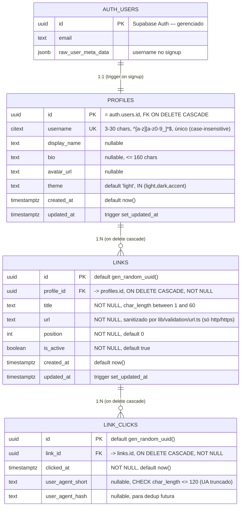

# Modelo ER Consolidado — youtube-biolink

> **Owner:** @data-engineer (Dara) · **Pré-requisito:** PRE-1 do EPIC-3 (PRD §7 M3)
> **Escopo:** entidades do MVP (Epics 1–3) + `link_clicks` (Epic 5, Story 5.1).
> As RLS policies (Epic 6) seguem documentadas como *forward-looking* ao final.

## Visão geral

No MVP a autorização era **application-layer** (Server Actions filtram por
`auth.uid()`), sem RLS. O Epic 6 **adiciona** RLS como segunda barreira, sem
remover os filtros de aplicação (NFR3, defense-in-depth): `profiles` (Story 6.1,
migration `20260719170252_profiles_rls.sql`) e `links` (Story 6.2, migration
`20260719171040_links_rls.sql`) já estão com RLS ligada; `link_clicks` segue sem
RLS até a Story 6.3. O ER abaixo
reflete o schema **real aplicado** (`profiles`, migration `20260614220038`) e o
schema **planejado** (`links`, Story 3.1).

## Relacionamentos

| De | Para | Cardinalidade | Regra |
|----|------|---------------|-------|
| `auth.users` | `profiles` | 1:1 | `profiles.id` referencia `auth.users(id)` `ON DELETE CASCADE`. Criado no signup via trigger `on_auth_user_created` → `handle_new_user()` (SECURITY DEFINER). |
| `profiles` | `links` | 1:N | `links.profile_id` referencia `profiles(id)` `ON DELETE CASCADE`. Deletar o profile remove todos os links. |
| `links` | `link_clicks` | 1:N | `link_clicks.link_id` referencia `links(id)` `ON DELETE CASCADE`. Deletar o link remove seus cliques. Tabela append-only (analytics). |

## Fundações compartilhadas (baseline — Story 1.4)

- **Extensões:** `pgcrypto` (`gen_random_uuid()`), `citext` (username case-insensitive).
- **Função:** `public.set_updated_at()` — reusada pelos triggers `updated_at` de
  `profiles` e (a criar) `links`.

## Índices

| Tabela | Índice | Propósito |
|--------|--------|-----------|
| `profiles` | `UNIQUE (username)` | unicidade case-insensitive (via `citext`) + lookup da página pública por username. |
| `links` | `(profile_id, position)` | ordenação dos links por usuário — leitura do dashboard e da página pública. *(a criar na Story 3.1 AC2.)* |
| `link_clicks` | `(link_id, clicked_at DESC)` | agregações/leituras de analytics por link, ordenadas por recência. *(Story 5.1 AC2.)* |

## Regras de autorização

### `profiles` — RLS **ligada** (Story 6.1, Epic 6)

Migration `20260719170252_profiles_rls.sql` — policies criadas e `ENABLE ROW LEVEL
SECURITY` no mesmo arquivo (habilitar sem policy = lockout).

| Policy | Comando | Roles | Expressão |
|---|---|---|---|
| `profiles_select_public` | SELECT | `anon`, `authenticated` | `USING (true)` |
| `profiles_update_own` | UPDATE | `authenticated` | `USING (id = (select auth.uid()))` · `WITH CHECK (id = (select auth.uid()))` |

- **Leitura é pública por design.** Todas as colunas de `profiles` já eram públicas
  (a página `/@username` lê 5 delas com a anon key) e a checagem de username
  duplicado do signup roda como role `anon` (`lib/actions/auth.ts:37`) — uma policy
  de SELECT baseada em `auth.uid()` quebraria o cadastro **silenciosamente**.
  A RLS aqui protege **escrita**.
- **Sem policy de INSERT:** o único INSERT é o trigger `handle_new_user()`
  (`SECURITY DEFINER`, owner `postgres` → `BYPASSRLS`), que roda fora do contexto RLS.
- **Sem policy de DELETE:** remoção só via `ON DELETE CASCADE` de `auth.users`.
- **App-layer intacta:** os filtros `.eq('id', user.id)` de `lib/actions/profile.ts`
  e do dashboard permanecem — a RLS soma, não substitui.

### `links` — RLS **ligada** (Story 6.2, Epic 6)

Migration `20260719171040_links_rls.sql` — as 5 policies e `ENABLE ROW LEVEL SECURITY`
no mesmo arquivo. Nomes conforme PRD Story 3.1 AC3 (L529).

| Policy | Comando | Roles | Expressão |
|---|---|---|---|
| `links_select_public_active` | SELECT | `anon`, `authenticated` | `USING (is_active = true)` |
| `links_select_own` | SELECT | `authenticated` | `USING (profile_id = (select auth.uid()))` |
| `links_insert_own` | INSERT | `authenticated` | `WITH CHECK (profile_id = (select auth.uid()))` |
| `links_update_own` | UPDATE | `authenticated` | `USING (profile_id = (select auth.uid()))` · `WITH CHECK (profile_id = (select auth.uid()))` |
| `links_delete_own` | DELETE | `authenticated` | `USING (profile_id = (select auth.uid()))` |

- **Duas policies de SELECT, combinadas por OR** (ambas PERMISSIVE). É o ponto central:
  o dashboard lista os links do dono **sem** filtro de `is_active`
  (`app/dashboard/links/page.tsx:18`, `lib/analytics/clicks.ts:59`), então uma policy
  única `USING (is_active = true)` esconderia os links desativados **do próprio dono** —
  o toggle viraria "o link sumiu". Resultado efetivo: `anon` vê só links ativos;
  `authenticated` vê todos os próprios (ativos e inativos) **mais** os ativos de
  terceiros (necessário para renderizar a página pública de outro usuário).
- **`WITH CHECK` no UPDATE** valida a linha *resultante* — é o que impede "doar" um link
  a outro perfil trocando `profile_id`.
- **RETURNING exige policy de SELECT:** as actions fazem `.select(...)` após
  UPDATE/DELETE (`lib/actions/links.ts:131`, `:198`, `:227`). `links_select_own` cobre —
  inclusive no toggle que acabou de setar `is_active = false`.
- **App-layer intacta:** os filtros `.eq('profile_id', user.id)` das Server Actions e o
  `.eq('is_active', true)` de `lib/queries/public-page.ts` permanecem — a RLS soma.
- **Sanitização de URL:** `sanitizeLinkUrl()` (Story 3.2) roda **antes** de qualquer
  INSERT/UPDATE — só `http(s)` chega ao DB.

### `link_clicks` — ainda sem RLS (Story 6.3)

- Autorização application-layer: `lib/analytics/clicks.ts` resolve primeiro os `link_id`
  do próprio profile e só então lê a agregação restrita a esses ids.
- A view `link_click_daily` ainda é legível por `anon` — vazamento ativo tratado na
  Story 6.3 (ver inventário § 4/R3).

## Forward-looking (fora do Epic 3)

| Entidade / mudança | Epic | Nota |
|--------------------|------|------|
| RLS + policies em `link_clicks` | Epic 6 | Story 6.3 — a RLS **soma** ao app-layer (NFR3), não o substitui. `profiles` (6.1) e `links` (6.2) já entregues. |
| `security_invoker` + revogação de `anon` na view `link_click_daily` | Epic 6 | Story 6.3 — vazamento ativo hoje (ver inventário § 4/R3). |

> `link_clicks` (Epic 5, Story 5.1) já está entregue e documentada acima como
> entidade real (schema aplicado). A coleta de cliques (Server Action com UA
> truncado, sem IP raw) é a Story 5.2.

---
*Gerado por @data-engineer como input das stories 3.1 (schema) e 5.1 (analytics).*
