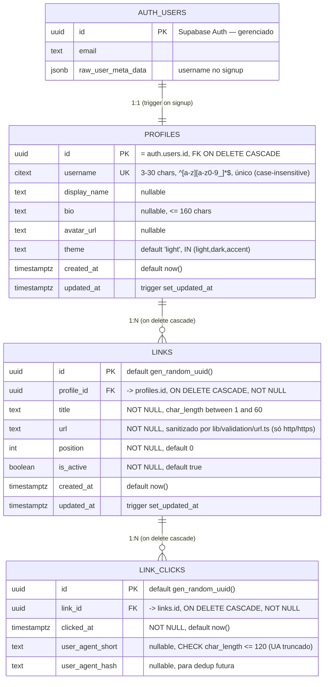

# Modelo ER Consolidado — youtube-biolink

> **Owner:** @data-engineer (Dara) · **Pré-requisito:** PRE-1 do EPIC-3 (PRD §7 M3)
> **Escopo:** entidades do MVP (Epics 1–3) + `link_clicks` (Epic 5, Story 5.1).
> As RLS policies (Epic 6) seguem documentadas como *forward-looking* ao final.

## Visão geral

No MVP a autorização é **application-layer** (Server Actions filtram por
`auth.uid()`), sem RLS — o RLS entra no Epic 6 (stories 6.1–6.3). O ER abaixo
reflete o schema **real aplicado** (`profiles`, migration `20260614220038`) e o
schema **planejado** (`links`, Story 3.1).

## Relacionamentos

| De | Para | Cardinalidade | Regra |
|----|------|---------------|-------|
| `auth.users` | `profiles` | 1:1 | `profiles.id` referencia `auth.users(id)` `ON DELETE CASCADE`. Criado no signup via trigger `on_auth_user_created` → `handle_new_user()` (SECURITY DEFINER). |
| `profiles` | `links` | 1:N | `links.profile_id` referencia `profiles(id)` `ON DELETE CASCADE`. Deletar o profile remove todos os links. |
| `links` | `link_clicks` | 1:N | `link_clicks.link_id` referencia `links(id)` `ON DELETE CASCADE`. Deletar o link remove seus cliques. Tabela append-only (analytics). |

## Fundações compartilhadas (baseline — Story 1.4)

- **Extensões:** `pgcrypto` (`gen_random_uuid()`), `citext` (username case-insensitive).
- **Função:** `public.set_updated_at()` — reusada pelos triggers `updated_at` de
  `profiles` e (a criar) `links`.

## Índices

| Tabela | Índice | Propósito |
|--------|--------|-----------|
| `profiles` | `UNIQUE (username)` | unicidade case-insensitive (via `citext`) + lookup da página pública por username. |
| `links` | `(profile_id, position)` | ordenação dos links por usuário — leitura do dashboard e da página pública. *(a criar na Story 3.1 AC2.)* |
| `link_clicks` | `(link_id, clicked_at DESC)` | agregações/leituras de analytics por link, ordenadas por recência. *(Story 5.1 AC2.)* |

## Regras de autorização no MVP (sem RLS)

- **Escrita (`links`):** Server Actions (`createLink`/`updateLink`/`deleteLink`/
  `toggleActive`/`reorderLinks`) filtram por `profile_id = auth.uid()`. Usuário A
  não altera links de B.
- **Leitura pública (`/@username`):** query filtra `is_active = true` e
  `profile_id` do username resolvido. Links inativos nunca são expostos.
- **Sanitização de URL:** `sanitizeLinkUrl()` (Story 3.2) roda **antes** de qualquer
  INSERT/UPDATE — só `http(s)` chega ao DB.

## Forward-looking (fora do Epic 3)

| Entidade / mudança | Epic | Nota |
|--------------------|------|------|
| RLS + policies em `profiles` / `links` / `link_clicks` | Epic 6 | stories 6.1/6.2/6.3 — autorização migra do app-layer para o banco. |

> `link_clicks` (Epic 5, Story 5.1) já está entregue e documentada acima como
> entidade real (schema aplicado). A coleta de cliques (Server Action com UA
> truncado, sem IP raw) é a Story 5.2.

---
*Gerado por @data-engineer como input das stories 3.1 (schema) e 5.1 (analytics).*
