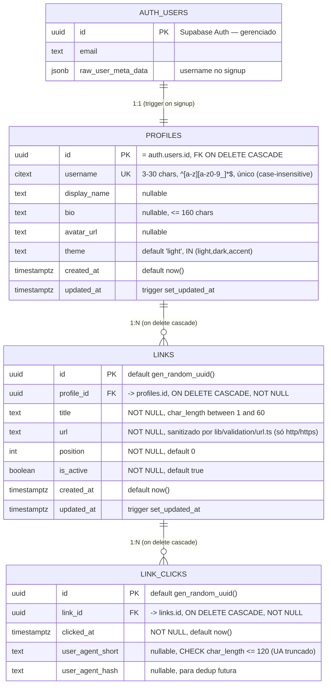

# Modelo ER Consolidado — youtube-biolink

> **Owner:** @data-engineer (Dara) · **Pré-requisito:** PRE-1 do EPIC-3 (PRD §7 M3)
> **Escopo:** entidades do MVP (Epics 1–3) + `link_clicks` (Epic 5, Story 5.1).
> As RLS policies (Epic 6) seguem documentadas como *forward-looking* ao final.

## Visão geral

No MVP a autorização era **application-layer** (Server Actions filtram por
`auth.uid()`), sem RLS. O Epic 6 **adiciona** RLS como segunda barreira, sem
remover os filtros de aplicação (NFR3, defense-in-depth): `profiles` (Story 6.1,
migration `20260719170252_profiles_rls.sql`) e `links` (Story 6.2, migration
`20260719171040_links_rls.sql`) e `link_clicks` (Story 6.3, migration
`20260719180000_link_clicks_rls.sql`) já estão com RLS ligada. O ER abaixo
reflete o schema **real aplicado** (`profiles`, migration `20260614220038`) e o
schema **planejado** (`links`, Story 3.1).

## Relacionamentos

| De | Para | Cardinalidade | Regra |
|----|------|---------------|-------|
| `auth.users` | `profiles` | 1:1 | `profiles.id` referencia `auth.users(id)` `ON DELETE CASCADE`. Criado no signup via trigger `on_auth_user_created` → `handle_new_user()` (SECURITY DEFINER). |
| `profiles` | `links` | 1:N | `links.profile_id` referencia `profiles(id)` `ON DELETE CASCADE`. Deletar o profile remove todos os links. |
| `links` | `link_clicks` | 1:N | `link_clicks.link_id` referencia `links(id)` `ON DELETE CASCADE`. Deletar o link remove seus cliques. Tabela append-only (analytics). |

## Fundações compartilhadas (baseline — Story 1.4)

- **Extensões:** `pgcrypto` (`gen_random_uuid()`), `citext` (username case-insensitive).
- **Função:** `public.set_updated_at()` — reusada pelos triggers `updated_at` de
  `profiles` e (a criar) `links`.

## Índices

| Tabela | Índice | Propósito |
|--------|--------|-----------|
| `profiles` | `UNIQUE (username)` | unicidade case-insensitive (via `citext`) + lookup da página pública por username. |
| `links` | `(profile_id, position)` | ordenação dos links por usuário — leitura do dashboard e da página pública. *(a criar na Story 3.1 AC2.)* |
| `link_clicks` | `(link_id, clicked_at DESC)` | agregações/leituras de analytics por link, ordenadas por recência. *(Story 5.1 AC2.)* |

## Regras de autorização

### `profiles` — RLS **ligada** (Story 6.1, Epic 6)

Migration `20260719170252_profiles_rls.sql` — policies criadas e `ENABLE ROW LEVEL
SECURITY` no mesmo arquivo (habilitar sem policy = lockout).

| Policy | Comando | Roles | Expressão |
|---|---|---|---|
| `profiles_select_public` | SELECT | `anon`, `authenticated` | `USING (true)` |
| `profiles_update_own` | UPDATE | `authenticated` | `USING (id = (select auth.uid()))` · `WITH CHECK (id = (select auth.uid()))` |

- **Leitura é pública por design.** Todas as colunas de `profiles` já eram públicas
  (a página `/@username` lê 5 delas com a anon key) e a checagem de username
  duplicado do signup roda como role `anon` (`lib/actions/auth.ts:37`) — uma policy
  de SELECT baseada em `auth.uid()` quebraria o cadastro **silenciosamente**.
  A RLS aqui protege **escrita**.
- **Sem policy de INSERT:** o único INSERT é o trigger `handle_new_user()`
  (`SECURITY DEFINER`, owner `postgres` → `BYPASSRLS`), que roda fora do contexto RLS.
- **Sem policy de DELETE:** remoção só via `ON DELETE CASCADE` de `auth.users`.
- **App-layer intacta:** os filtros `.eq('id', user.id)` de `lib/actions/profile.ts`
  e do dashboard permanecem — a RLS soma, não substitui.

### `links` — RLS **ligada** (Story 6.2, Epic 6)

Migration `20260719171040_links_rls.sql` — as 5 policies e `ENABLE ROW LEVEL SECURITY`
no mesmo arquivo. Nomes conforme PRD Story 3.1 AC3 (L529).

| Policy | Comando | Roles | Expressão |
|---|---|---|---|
| `links_select_public_active` | SELECT | `anon`, `authenticated` | `USING (is_active = true)` |
| `links_select_own` | SELECT | `authenticated` | `USING (profile_id = (select auth.uid()))` |
| `links_insert_own` | INSERT | `authenticated` | `WITH CHECK (profile_id = (select auth.uid()))` |
| `links_update_own` | UPDATE | `authenticated` | `USING (profile_id = (select auth.uid()))` · `WITH CHECK (profile_id = (select auth.uid()))` |
| `links_delete_own` | DELETE | `authenticated` | `USING (profile_id = (select auth.uid()))` |

- **Duas policies de SELECT, combinadas por OR** (ambas PERMISSIVE). É o ponto central:
  o dashboard lista os links do dono **sem** filtro de `is_active`
  (`app/dashboard/links/page.tsx:18`, `lib/analytics/clicks.ts:59`), então uma policy
  única `USING (is_active = true)` esconderia os links desativados **do próprio dono** —
  o toggle viraria "o link sumiu". Resultado efetivo: `anon` vê só links ativos;
  `authenticated` vê todos os próprios (ativos e inativos) **mais** os ativos de
  terceiros (necessário para renderizar a página pública de outro usuário).
- **`WITH CHECK` no UPDATE** valida a linha *resultante* — é o que impede "doar" um link
  a outro perfil trocando `profile_id`.
- **RETURNING exige policy de SELECT:** as actions fazem `.select(...)` após
  UPDATE/DELETE (`lib/actions/links.ts:131`, `:198`, `:227`). `links_select_own` cobre —
  inclusive no toggle que acabou de setar `is_active = false`.
- **App-layer intacta:** os filtros `.eq('profile_id', user.id)` das Server Actions e o
  `.eq('is_active', true)` de `lib/queries/public-page.ts` permanecem — a RLS soma.
- **Sanitização de URL:** `sanitizeLinkUrl()` (Story 3.2) roda **antes** de qualquer
  INSERT/UPDATE — só `http(s)` chega ao DB.

### `link_clicks` — RLS aplicada (Story 6.3, `20260719180000_link_clicks_rls.sql`)

| Policy | Comando | Roles | Predicado |
|--------|---------|-------|-----------|
| `link_clicks_select_own` | SELECT | `authenticated` | `EXISTS (select 1 from links l where l.id = link_clicks.link_id and l.profile_id = (select auth.uid()))` |

- **NÃO existe policy de INSERT, UPDATE ou DELETE — e isso é o ponto.** Com RLS
  habilitada, ausência de policy = **negação**. A tabela vira append-only *no banco*, e a
  escrita direta com a anon key (que é pública, vai no bundle) passa a ser recusada —
  fechando o concern MEDIUM do gate do Epic 5. A proposta `link_clicks_insert_active` do
  inventário foi descartada pelo `@pm`: permitir INSERT em "qualquer link ativo" é
  exatamente o abuso a fechar.
- **`link_clicks` não tem `profile_id`;** o único caminho até o dono é o join lógico via
  `links`, avaliado sob a RLS do chamador (daí a dependência da Story 6.2).
- **Escrita: exclusividade da RPC `record_link_click(uuid, text) → boolean`**
  (`SECURITY DEFINER`, `set search_path = public`, `revoke all from public` +
  `grant execute to anon, authenticated`). Valida `links.is_active` e insere na **mesma
  transação** — sem janela TOCTOU — e trunca o UA com `left(...,120)` em paridade com o
  CHECK. Retorna `false` (sem gravar) para link inativo ou inexistente; nunca lança.
  `lib/actions/track-click.ts` chama só ela, com `createPublicClient()`: **nenhum client
  novo, nenhum env novo** — o padrão `createAdminClient`/service-role foi *refutado* pelo
  ADR-001 § 2.
- **App-layer intacta (NFR3):** `lib/analytics/clicks.ts` continua resolvendo os
  `link_id` do profile antes de ler a agregação. A RLS soma.
- **`ON DELETE CASCADE` inalterado:** ações de integridade referencial rodam por trigger
  interno, fora do filtro de RLS e de GRANTs do chamador.

### View `link_click_daily` — hardening (Story 6.3)

Vazamento **ativo** até esta story: a view foi criada sem `security_invoker` (default
`false`), logo executava com os privilégios do **owner** (`postgres`, que tem
`BYPASSRLS`), e tinha `grant select ... to anon`. Habilitar RLS em `link_clicks` **não**
teria fechado nada — a view furaria por cima, e qualquer um com a anon key leria a
agregação de cliques de todos os perfis. Correções aplicadas na mesma migration:

- `alter view public.link_click_daily set (security_invoker = on)` → executa com os
  privilégios do **chamador**, respeitando `link_clicks_select_own`. Efeito registrado: o
  `count(*)` passa a ser calculado sobre as linhas visíveis ao chamador — a semântica da
  agregação muda **por role** (cada dono conta os próprios cliques).
- `revoke all on public.link_click_daily from anon` (não só SELECT: o default do Supabase
  concedia também INSERT/UPDATE/DELETE/TRUNCATE) e `revoke insert, update, delete,
  truncate ... from authenticated`; `grant select ... to authenticated` permanece.
- `grant select on public.link_clicks to authenticated` — **obrigatório**: com
  `security_invoker`, o chamador precisa de privilégio na **tabela base**. Sem isso o
  dashboard receberia `permission denied for table link_clicks`.
- `revoke insert, update, delete, truncate on public.link_clicks from anon, authenticated`
  — segunda camada sob a negação da RLS (não afeta a RPC, que roda como owner).

### `rate_limit_counters` — rate limiting (Story 6.4, `20260719190000_rate_limit.sql`)

Tabela **puramente interna**: RLS habilitada **sem policy** (deny-all) e
`revoke all ... from anon, authenticated`. Nenhuma role de aplicação a enxerga — nem
para descobrir quanto do próprio limite já gastou. Só a função `SECURITY DEFINER`
`check_rate_limit`, que roda como o owner, a lê e escreve.

| Coluna | Tipo | Nota |
|--------|------|------|
| `bucket` | `text` | `signup` \| `login` \| `reset` \| `track` \| `track_link` |
| `subject` | `text` | **Digest hex de 64 chars** (SHA-256 + pepper do IP) para os buckets de app; `link_id` (uuid) para `track_link`. **NUNCA IP raw** (NFR19) |
| `window_start` | `timestamptz` | Início do sub-bucket (truncado) |
| `hits` | `int` | Contador do sub-bucket |

PK composta `(bucket, subject, window_start)` + índice em `(window_start)` (housekeeping).

- **`check_rate_limit(text, text, int, int, int) → boolean`** — janela deslizante por
  sub-buckets, `SECURITY DEFINER`, `set search_path = public`, `revoke all from public` +
  `grant execute to anon, authenticated`. Serializa por chave com
  `pg_advisory_xact_lock`; soma os sub-buckets dentro da janela; **quando estourado
  retorna `false` SEM incrementar** (não estende a punição); housekeeping oportunista
  (~1% das chamadas) apaga registros com mais de 24h. Termina com
  `exception when others then return true` — **fail-open deliberado** (disponibilidade
  acima de throttle; ADR-001 § 3/§ 4).
- **Targets do NFR18:** `signup` 5/3600s · `login` 10/900s · `reset` 3/3600s ·
  `track` 60/60s por `hash(ip + ':' + linkId)` — aplicados em `lib/rate-limit.ts`.
- **Nenhum IP é persistido em lugar nenhum.** O IP é lido dos headers da borda
  (`x-forwarded-for` leftmost → `x-real-ip` → `'unknown'`), usado **em memória** e
  descartado; só o digest sai do processo. Env `RATE_LIMIT_PEPPER` (server-only, **nunca**
  `NEXT_PUBLIC_*`, não privilegiado).

#### Mudanças da 6.4 em `record_link_click` e `link_clicks`

- **Teto por link DENTRO da RPC.** `record_link_click` passou a chamar
  `check_rate_limit('track_link', p_link_id::text, 60, 60, 10)` antes do INSERT.
  Motivo (concern #1 do gate da Wave 2, **provado por probe**): a RPC é
  `grant execute to anon` e chamável direto pelo PostgREST, então um rate limit que
  vivesse só na Server Action fecharia a porta da frente com a dos fundos aberta.
  O teto é avaliado em **toda** chamada, venha de onde vier. **A assinatura
  `(uuid, text)` NÃO mudou** — `create or replace` substitui o corpo e não cria
  sobrecarga (uma sobrecarga sem teto seria o próprio bypass de volta).
- **`revoke select, references, trigger on link_clicks from anon`** (concern #2 do
  mesmo gate): restaura a simetria de defesa em camadas — a escrita já tinha duas
  (RLS + ausência de grant), a leitura tinha só a RLS. `authenticated` **mantém o
  SELECT**, exigido pela view `link_click_daily` com `security_invoker = on`.
  Efeito observável: `GET /rest/v1/link_clicks` anônimo passou de `200 []` para
  `permission denied` (42501).

## Forward-looking (fora do Epic 3)

| Entidade / mudança | Epic | Nota |
|--------------------|------|------|
| — | — | Sem entidades pendentes. `rate_limit_counters` foi entregue pela Story 6.4 e está documentada acima. |

> `link_clicks` (Epic 5, Story 5.1) já está entregue e documentada acima como
> entidade real (schema aplicado). A coleta de cliques (Server Action com UA
> truncado, sem IP raw) é a Story 5.2.

---
*Gerado por @data-engineer como input das stories 3.1 (schema) e 5.1 (analytics).*
